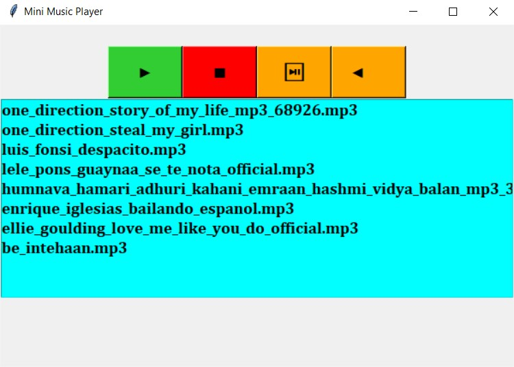

## Python Scripts by Sufiyan

### Files Added

- Fetch - API
    - Sends GET Request
    - Prints response
- File System Cleaner
    - It clears all the files with extension given
    - It not clear in parent directory but also in all subdriectory
- Music Player
    - It detects songs stored in songs folder
    - GUI using tkinter
    - 
